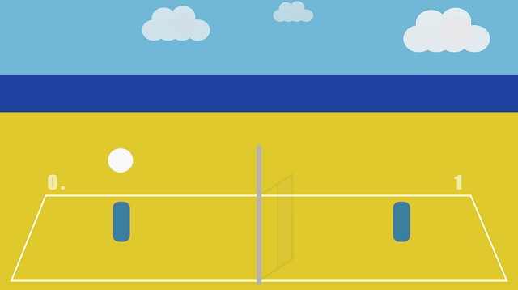

# Minimalist Volley

Currently in development ^^

Don't look too much at the code quality / readability for the moment

The game is automatically deployed on https://kefniark.github.io/volley-js13k/

## Description
Try to make a small volley game for the js13kgames competition (http://js13kgames.com/)

My idea:
 * The theme is "Offline", it's summer ... time to go outside and do some sport no?
 * Inspired by (Blobby volley)[https://en.wikipedia.org/wiki/Blobby_Volley], a game I played clearly too much back in the day.
 * Minimalist design with vector graphics.

## Rules
 * Package size below 13 kB
 * No external libraries or services
 * You have to have the rights for every asset used in your game

## Commands
Setup
```
npm install
```

Development (and open http://localhost:9000/):
```
npm run dev
```

Make a build
```
npm run build
```

## Screenshot


## License
(WTFPL)[http://www.wtfpl.net/about/]
